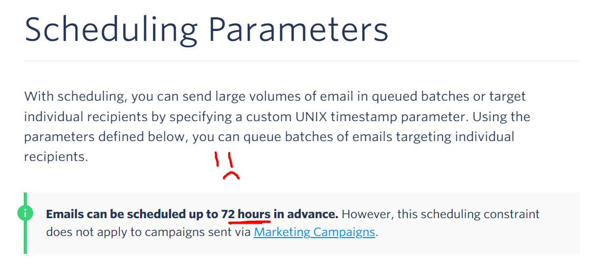
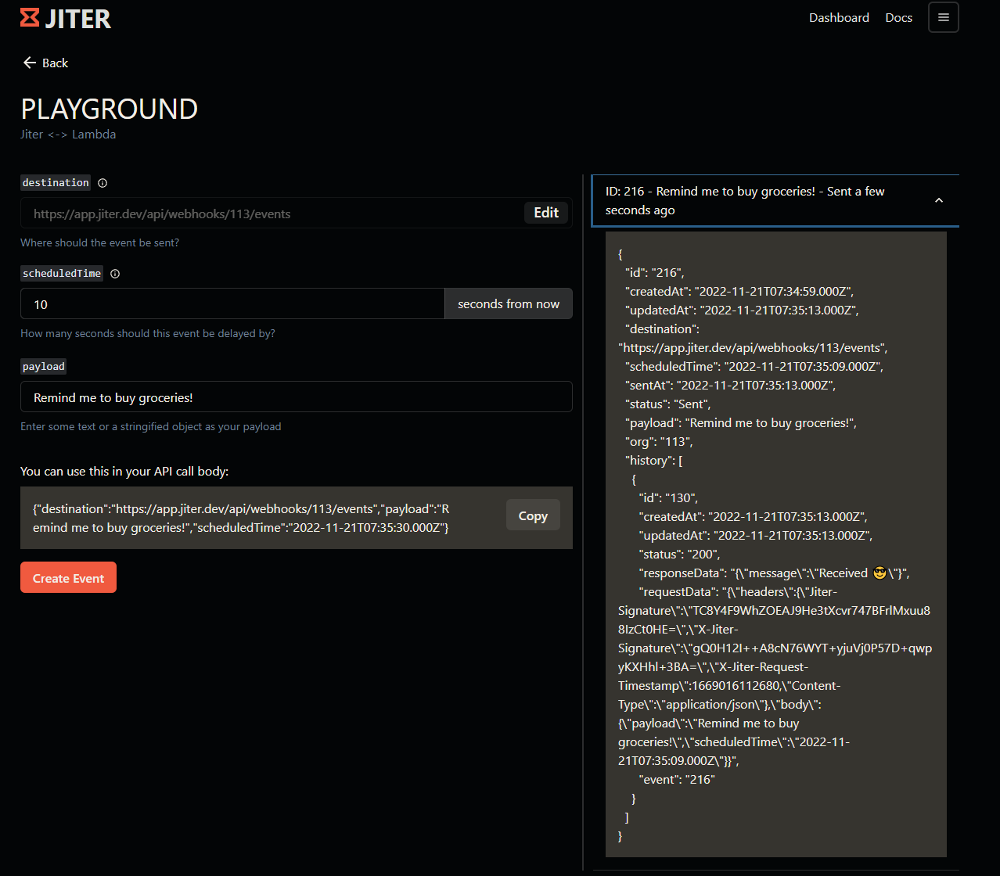
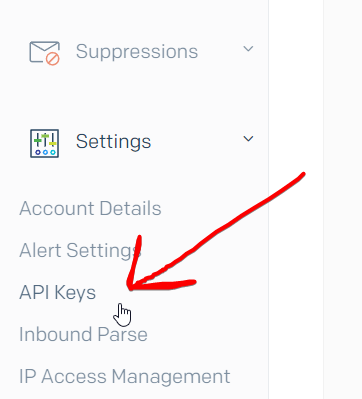
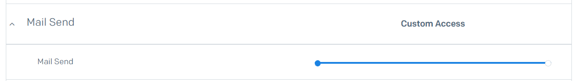
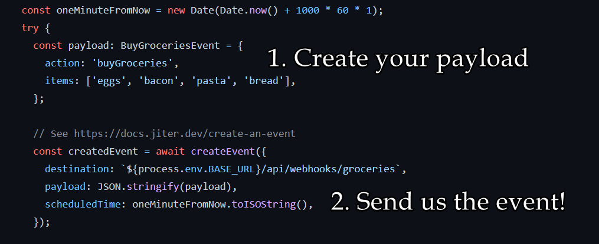
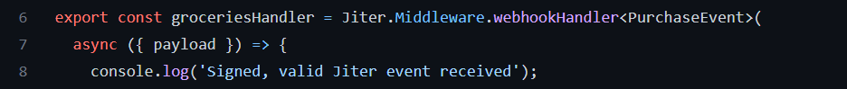
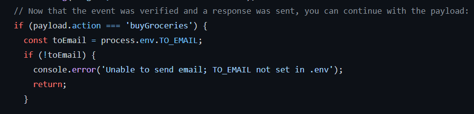
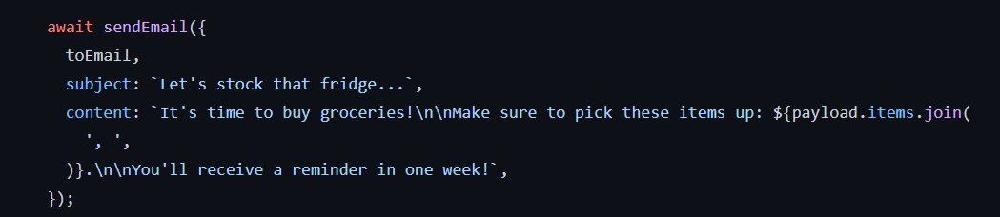
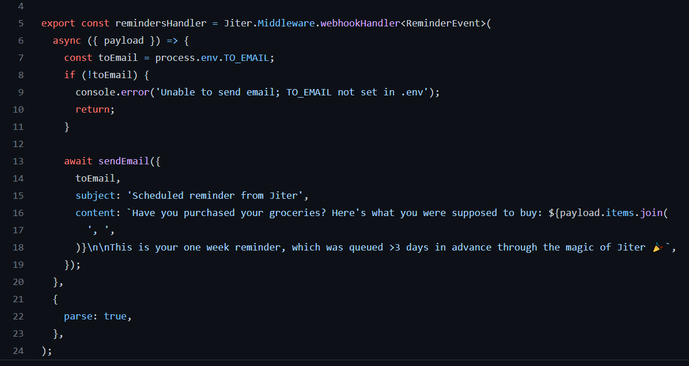

In today's blog we're going to show you how to delay an email more than 72 hours in the future on SendGrid using Jiter.

<!--truncate-->

:::note

We have created an example [repository on GitHub](https://github.com/SpencerKaiser/Jiter-Sendgrid-Example) for you to follow along!

:::

## The Problem

If you're trying to send a transactional email on SendGrid, you can only delay it by 72 hours in advance:

What if you want to delay it more than that? What if you want to send emails on a user's 7th or 30th day of being on your platform?

## The Solution

As you might have already guessed, the solution to this problem is pretty straightforward:

1. Create a new database table to keep track of user notifications, who needs to get notified, and when
2. Push your migration to ~~testing~~ production and pray that nothing broke
3. Create a CRON job that checks your database every N `TIME_UNIT` for any users that need to get notified
4. Create a CRON job handler in your app to initialize all CRON jobs on app start
5. Ensure that no two CRON jobs run concurrently incase they need to read / write to the same rows
6. Ensure that you're locking data properly so the table scans that you're doing in the cron jobs don't interfere with other instances of the app (you are running multiple instances of the app right?)
7. Perform a heavy database read when the job runs because you forgot that indexes are a thing
8. Repeat the database read every minute because you actually meant to schedule it [at a different time](https://crontab.guru/)
9. Finally realize your jobs are not running at your desired time because you forgot timezones are a thing and you deploy to `us-east-1` like a [madlad](https://www.lastweekinaws.com/blog/lessons-in-trust-from-us-east-1/)

## The Actual Solution

What if you could send an API call to a service with a timestamp and payload when the user is created... aaaaaaand receive that event back at that timestamp on your server?

### 1. Get your Jiter API Key and Signing Secret

Check out our [getting started](/getting-started) page which walks you through getting your API key on [our site](https://jiter.dev/).
The signing secret is used to verify that the event came from us, and not a malicious third party.

:::info
We recently launched a [playground](https://jiter.dev/)! You can test out creating and receiving events without setting anything up locally :)

:::

### 2. Get your SendGrid API Key

When you log in to SendGrid, go to `Settings` on the left sidebar and click on API keys

and create a new API key with the `Mail Send` permission:

### 3. Clone our repository / Set up your server

As mentioned earlier, we created an example repository which you can follow along with [here](https://github.com/SpencerKaiser/Jiter-Sendgrid-Example).

The steps in the `README.md` are pretty straightforward, they involve setting up your credentials in a `.env` file and it's using [ngrok](https://ngrok.com/) to allow your local machine to receive events from our servers.
If you don't want to set anything up locally you can use our [playground](https://app.jiter.dev/) and if you're looking for a custom URL, we recommend [requestcatcher.com](https://requestcatcher.com/)

### 4. Create the event

If you go to the [POST /events.ts](https://github.com/SpencerKaiser/Jiter-Sendgrid-Example/blob/main/src/api/events/post.ts) endpoint, you can see how simple using Jiter is. In our example, we are simulating a user that wants to buy groceries and sending them a reminder email in one week. All you need is the destination, payload, and the ISO timestamp on when you would like to receive the event:

### 5. Listen for the event

In the [GET /webhooks/groceriesHandler.ts](https://github.com/SpencerKaiser/Jiter-Sendgrid-Example/blob/main/src/api/webhooks/groceriesHandler.ts) file, you might notice a middleware from the [Jiter SDK](https://www.npmjs.com/package/@jiter/node):

This middleware handles verifying the event for you, including the timestamp, signature, as well as responding back to our servers with a `4XX` or `200` error code. All you have to do is focus on your business logic.

We first check the action from the event payload which tells us what action to take and do another quick credentials check:

We send the user an _initial_ email telling them to buy groceries, and letting them know that we will send them a reminder email in one week.

We then repeat the previous process and and schedule another event with Jiter to be 7 days from now at our `/reminders` endpoint. Do note, the event can be scheduled at [any time in the future](https://docs.jiter.dev/create-an-event).

Our reminder handler is extremely straightforward thanks to the Jiter middleware. All we need to do is focus on our business logic of sending the email when it comes in:

Tada! That's how you can use Jiter to schedule delayed emails with SendGrid and bypass the 72 hour limit. Please let us know if you have any questions! We can be reached out on GitHub at [@joswayski](https://github.com/joswayski) and [@SpencerKaiser](https://github.com/SpencerKaiser).
or by email `jose` or `spencer` @pantheonlabs.com
