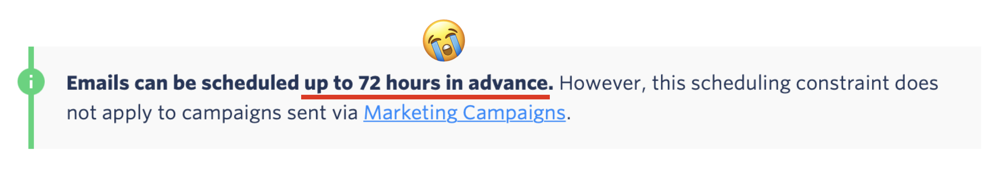
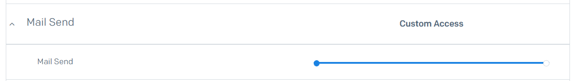
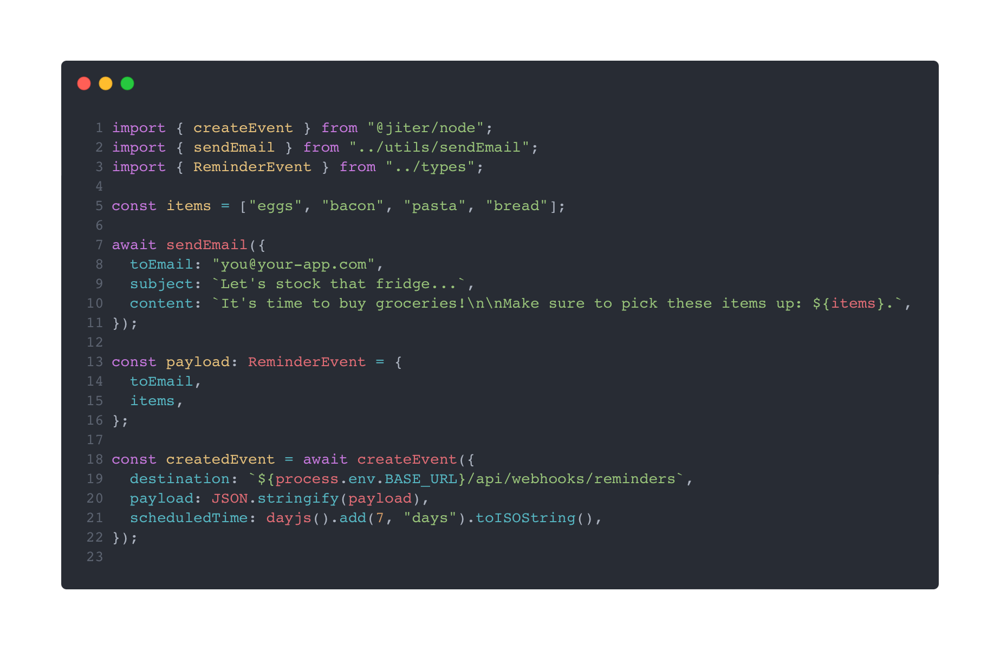
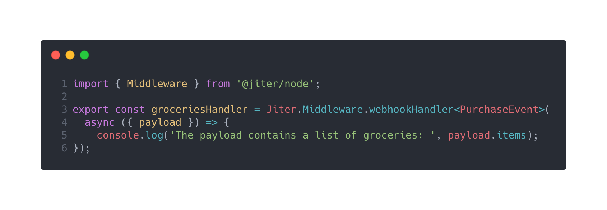
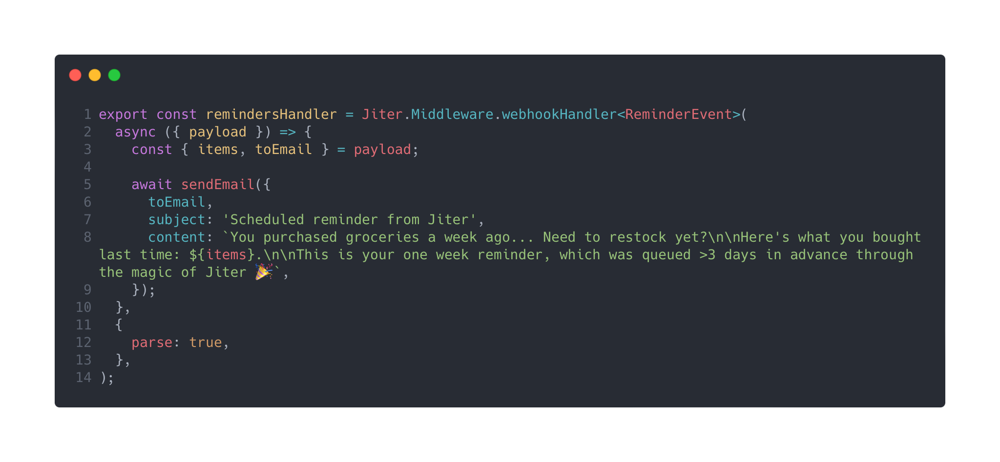

import Admonition from "@theme/Admonition";

<Admonition type="tip" icon="⏱️" title="TL;DR">
  

    We'll do our best to keep this short and sweet, but if you don't have the
    time, here's the gist:
  

  

    SendGrid only allows for the scheduling of emails up to{" "}
    <strong>three days</strong>. Use <a href="https://jiter.dev">Jiter</a> and
    schedule emails weeks/months in advance with less than 30 lines of code!
  

</Admonition>

<!--truncate-->

 

## The Problem

If you're trying to send a transactional email via SendGrid, [you can delay it by a **maximum** of 72 hours](https://docs.sendgrid.com/for-developers/sending-email/scheduling-parameters):

What if you want to delay it more than that? What if you want to send an email to that user 7 days after joining? What if you need to reevaluate whether you _should_ send the email at that time?

 

## The Solution

<Admonition type="tip" icon="🔎" title="Follow Along!">
  

    Check out our{" "}
    <a href="https://github.com/SpencerKaiser/Jiter-Sendgrid-Example">
      example repo on GitHub
    </a>{" "}
    which includes code snippets you can use in your own project!
  

</Admonition>

As you might have already guessed, the solution can be implemented in just nine simple steps (_that aren't actually simple_):

1. Create a cron job manager in your app to initialize all cron jobs on app start
   - [_Pause to question your architectural decisions and sanity_]
1. Create a new database table to keep track of user notifications (i.e., who needs to get notified and when)
   - _Or you can just add another column, because your database can take another one for the team_
1. Create a cron job that checks your new table for any relevant records in order to determine who should be notified
   - _And subsequently overburden your DB server with a super heavy query when the job runs because you forgot that indexes are a thing_
1. Spend 45 minutes creating a [cron expression](https://crontab.guru/) to schedule your cron job
   - _All while recognizing the similarity to Regular Expressions, having a panic attack, and then accidentally setting your cron job to run 60 times per hour instead of once per hour_
1. Ensure that you are locking rows properly so your don't perform redundant tasks on multiple instances of the app (.e.g., sending the same user two notifications)
   - _You **are** running multiple instances of the app, right?!_
1. Ensure that no two cron jobs referencing the same table run concurrently so they don't skip locked rows and exit prematurely
   - _Alternatively, you can skip this step and spend 6 hours debugging why a user record was apparently ignored_
1. Take a break to reevaluate your career choices
   - _This was probably on your schedule already_
1. Push your changes _straight to production_
   - _`#yolo`_
1. Realize your jobs are not running at your desired time because you forgot about timezones
   - _Because you deployed to `us-east-1`... [misery loves company](https://www.lastweekinaws.com/blog/lessons-in-trust-from-us-east-1/)_

**That's it! It's _THAT_ simple 🚀**

 

## The Actual Solution

Use Jiter 😉

But seriously, Jiter provides **Just In Time (JIT)** webhooks: you tell Jiter when you need to be reminded and what to remind you with, and we handle the rest.

To bypass this limitation with the SendGrid API, you can simply create an event with Jiter including a payload that will provide context (like what user to notify and what to notify them about), and then setup a webhook handler to actually trigger the email when the event is received.

If you want to send an email to a new user seven days after they join your platform, simply create a Jiter event with a `scheduledTime` 7 days from now and include information about that user (like an ID) in the payload. 7 days later, we'll send a request to your app and you can trigger the email to be immediately sent! It's that simple.

## Let's Build It...

The steps below describe how to use Jiter to schedule the delivery of an email one week after an API event takes place. Our example repo has the following components which are described in detail below:

- An API endpoint to track the intent of purchasing grocery items
- The creation of a Jiter event to remind the user to restock groceries 7 days later
- A handler which receives the Jiter webhook event and triggers an email to SendGrid (which will be delivered 7 days after the initial event)

### 1. Jiter Auth

Check out our [Getting Started](/getting-started) page which walks you through the creation of your first org and how to get your API Key and Signing Secret.

The **API Key** is used for authenticating _YOUR_ requests and the **Signing Secret** helps you verify the authenticity of _OUR_ webhook requests when we send them to your app.

<Admonition type="info" icon="🛠️" title="Try the API">
  

    We recently launched the{" "}
    <a href="https://app.jiter.dev">Jiter Playground</a>! You can create and
    receive events without setting anything up locally 🤯 Check out our
  

  
</Admonition>

### 2. SendGrid Auth

- [Go to the API Keys page](https://app.sendgrid.com/settings/api_keys) (or log in to SendGrid, go to `Settings` on the left sidebar, and click on `API keys`)
- Click `Create API Key` in the top-right
- Choose `Restricted Access` and enable the `Mail Send` permission:
  
- Copy your API key for use later

### 3. Jiter Setup

As mentioned earlier, we created an [example repository](https://github.com/SpencerKaiser/Jiter-Sendgrid-Example); fork it and use it as a guide! You can copy snippets from that repo or follow our docs to configure the app your way.

The steps in the `README.md` are pretty straightforward, they involve setting up your credentials in a `.env` file and it's using [ngrok](https://ngrok.com) to allow your local machine to receive events from our servers.
If you don't want to set anything up locally you can use our [Playground](https://app.jiter.dev) and if you're looking for a custom URL, we recommend [`requestcatcher.com`](https://requestcatcher.com).

#### Updating an Existing App

If you're solving this problem within an existing app, use the example repo as a guide and make sure to do the following:

- Install the [`@jiter/node` SDK](https://www.npmjs.com/package/@jiter/node) (`npm i @jiter/node` or `yarn add @jiter/node`)
- [Initialize the Jiter SDK](https://github.com/SpencerKaiser/Jiter-Sendgrid-Example/blob/7c78f77bc6e6f9345103e635a66bea2aab7ec434/src/index.ts#L22-L25)
- Replicate the functionality from the next two sections ([Scheduling Events](#4-scheduling-events) and [Handling Webhook Events](#5-handling-webhook-events)) to create Jiter events and handle webhook events

### 4. Scheduling Events

The creation of an event is pretty simple via the Jiter SDK: just provide values for `scheduledTime` (when to deliver the webhook event), `payload` (what you want to receive as part of that event), and `destination` (the URL where we should send the `POST` request).

In our example (within the [`POST /api/events` handler](https://github.com/SpencerKaiser/Jiter-Sendgrid-Example/blob/main/src/api/events/post.ts)), we handle the API intent of purchasing groceries but added functionality to remind the user `7 days` later to restock:

The snippet above is an abstraction of the example repo: we send an email confirming the user's intent to purchase groceries and then use the `createEvent` method from the SDK to schedule a reminder set for 7 days later (which will send an event to `/api/webhooks/reminders`).

### 5. Handling Webhook Events

It's `7 days` later now... the future is here 🤖

When the webhook event comes to our app, we need to handle the request and take action using the `payload` as context.

In our example (within the [`POST api/webhooks/reminders` handler](https://github.com/SpencerKaiser/Jiter-Sendgrid-Example/blob/main/src/api/webhooks/reminders.ts)) we use the `Middleware` method from the Jiter SDK to create a handler that accepts the request, verifies its authenticity, sends back a `200` status, and then provides the parsed payload:

Now that we're ready to receive the reminder event, we need to implement some business logic to send the restock reminder email:

Because `parse: true` was passed to the `Middleware` method as an option, our `payload` was automatically parsed as JSON and we're able to safely deconstruct the `items` and `email` for use in our reminder email.

Tada! That's how you can use Jiter to schedule delayed emails with SendGrid and bypass the 72 hour limit.

## What did you think?

Was this blog post helpful? Do you regret your decision to skip past the TL;DR and read anyways? Did you have an epiphany and choose to pursue your dreams of baking?

Our team is eager to hear from you and help however we can. Get in touch with us via the [**Jiter Discord Server**](https://discord.com/invite/NPC6GBDBXp) or [**schedule time to chat with our dev team**](https://calendly.com/jiter/demo)!

 
 
 

  

    Still reading? We appreciate you... click here for your reward.
  

  <h3>Thanks for reading ❤️</h3>
  

